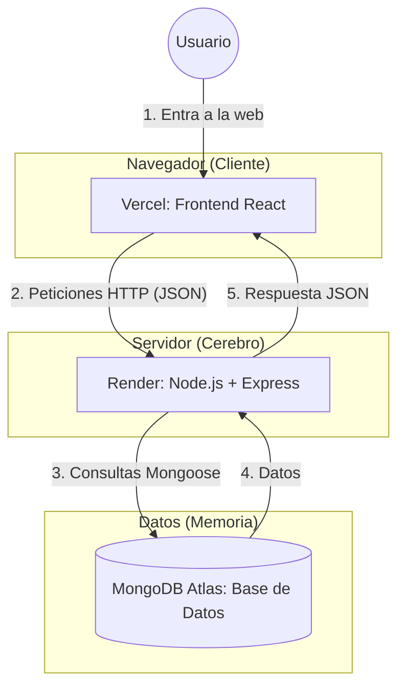
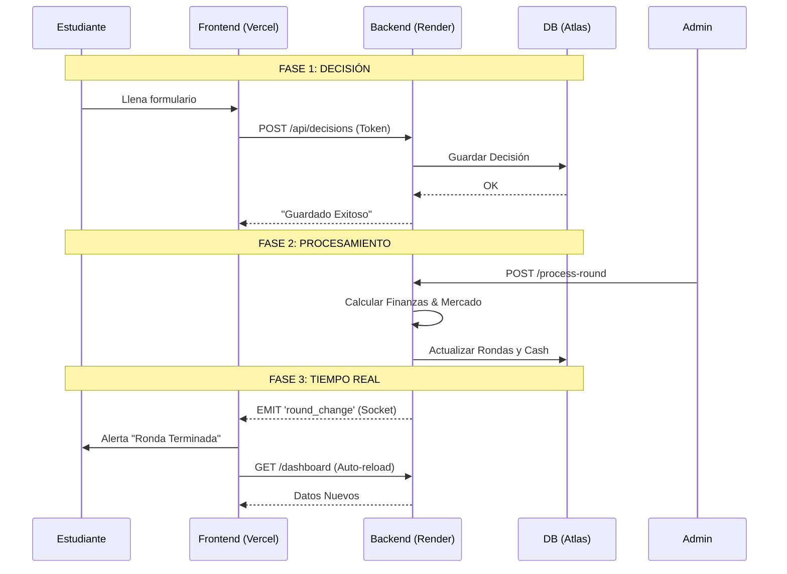

**Resumen de Arquitectura de Conexión** para **Simulador de Negocios ElectroNova**.

Este modelo se conoce como **Arquitectura MERN Desacoplada (Decoupled MERN Stack)** desplegada en la nube.

---

### 1. El Mapa de Infraestructura (¿Dónde vive cada cosa?)

La aplicación no vive en un solo lugar. Está distribuida en tres "casas" diferentes en la nube que conversan entre sí.

*   **Vercel (Frontend):** Es la "cara". Entrega los archivos visuales (HTML, CSS, JS) al navegador del estudiante. No procesa datos pesados, solo muestra.
*   **Render (Backend):** Es el "cerebro". Recibe las órdenes, hace los cálculos matemáticos (WSC, Costos, Inventario) y decide qué guardar.
*   **MongoDB Atlas:** Es la "memoria". Guarda los usuarios, las salas y las decisiones de forma permanente.

---

### 2. El Flujo de Comunicación (¿Cómo se hablan?)

Tu sistema usa dos "idiomas" para comunicarse:

#### A. REST API (Petición - Respuesta)
Es como una llamada telefónica: El cliente pregunta, el servidor responde y cuelgan.
*   **Uso:** Login, Guardar Decisión, Crear Sala.
*   **Conector:** Variable de entorno `VITE_API_URL` en Vercel.

#### B. WebSockets (Socket.io - Tiempo Real)
Es como un walkie-talkie siempre abierto.
*   **Uso:** El servidor avisa "¡La ronda terminó!" y el cliente se actualiza solo sin que el usuario toque nada.
*   **Conector:** Librería `socket.io-client` en el Frontend.

**Gráfico de Flujo de Juego:**

---

### 3. El Modelo de Seguridad (La Llave Maestra)

Para que nadie hackee tu juego o vea datos de otros, usamos **JWT (JSON Web Token)**.

1.  **Login:** El usuario envía usuario/contraseña.
2.  **Firma:** Render verifica en Atlas. Si es correcto, crea un "Pasaporte Digital" (Token) firmado con tu `JWT_SECRET` (esa clave larga que pusiste en Render).
3.  **Almacenamiento:** El Frontend guarda ese pasaporte en el navegador (`localStorage`).
4.  **Uso:** Cada vez que el estudiante pide ver su Dashboard, muestra el pasaporte. Si el pasaporte es falso o expiró, Render le cierra la puerta.

---

### Resumen para tu Documentación

Si necesitas explicar esto a tus estudiantes o colegas:

> "ElectroNova v1.0 opera en la nube. El estudiante accede a una interfaz en **Vercel** que se conecta de forma segura a un motor de simulación en **Render**. Todas las decisiones se almacenan encriptadas en **MongoDB**. Gracias a la tecnología de **Sockets**, cuando el profesor cierra la ronda, todos los estudiantes ven sus resultados instantáneamente en sus pantallas, simulando un mercado bursátil en vivo."
